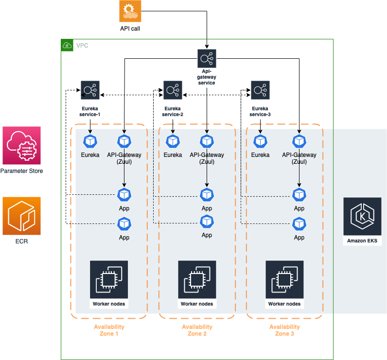
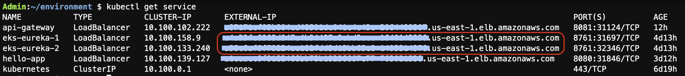
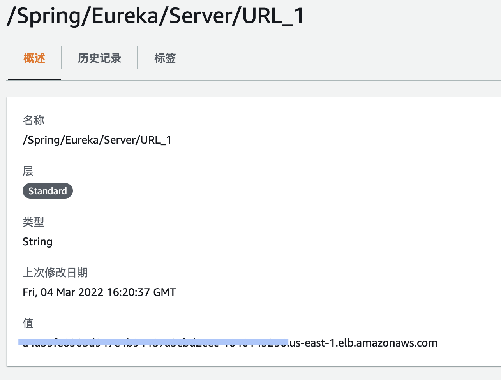
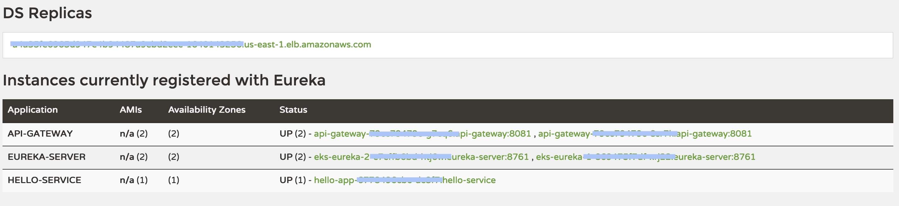

# EKS 上部署 Spring Cloud 示例项目

Spring Cloud是一个基于Spring Boot实现的微服务架构开发工具。它为微服务架构中涉及的配置管理、服务治理、断路器、智能路由、微代理、控制总线、全局锁、决策竞选、分布式会话和集群状态管理等操作提供了一种简单的开发方式。

由于Spring生态在Java开发者中具有广泛的影响力，Spring Cloud基于Spring Boot对大型项目开发难度的简化，对开发微服务所需的组件进行了简单高效的封装，Spring Cloud已成为Java领域开发微服务的实际标准。由于Spring Cloud技术已有较长的应用时间，用户把原有的虚拟机部署应用往更云原生的技术（如：容器 / Kubernetes）迁移可能会遇到各种问题，本系列将使用AWS EKS服务作为基础设施，在AWS上部署Spring Cloud应用，以给在AWS上容器化部署及迁移Spring Cloud应用遇到难题的开发者提供参考。

## 设计架构



演示架构使用 Kubernetes 中的 service 作为 Eureka 与 API-gateway 的访问入口。实际功能的 App 由 API-gateway 路由访问及管控访问授权。

## Eureka 的配置

由于 Eureka server 的信息需要固定，且能被各个 App 能从配置文件中配置并获取，因此利用 Parameter Store 对其作为公共变量存储

为 Eureka 创建 service，并获取获取 load balancer 的信息


Parameter Store 中的 Eureka URL 与 port 的配置


Spring Cloud 项目中的配置，请参考各项目中的`application.properties`文件
```properties
eureka.instance.hostname=${eureka_server_1}
eureka.client.service-url.defaultZone=http://${eureka_server_2}:${eureka_server_port}/eureka
```

## 部署效果

部署完成的效果可以从 Eureka 的 GUI 查看



## 更新历史

2020-12:
Spring Cloud 基于EC2 与 EKS 混合部署架构的实现。

2022-03-09:
Spring Cloud 基于 EKS 部署架构的实现。

## 附录

[AWS博客：
Spring Cloud 的云原生迁移 – AWS 上的混合部署架构（上篇）
](https://aws.amazon.com/cn/blogs/china/spring-clouds-cloud-native-migration-hybrid-deployment-architecture-on-aws-part-1/)

[AWS博客：
Spring Cloud 的云原生迁移 – AWS 上的混合部署架构（下篇）
](https://aws.amazon.com/cn/blogs/china/spring-clouds-cloud-native-migration-hybrid-deployment-architecture-on-aws-part-2/)